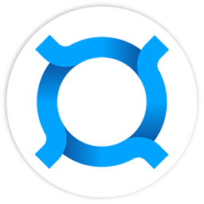
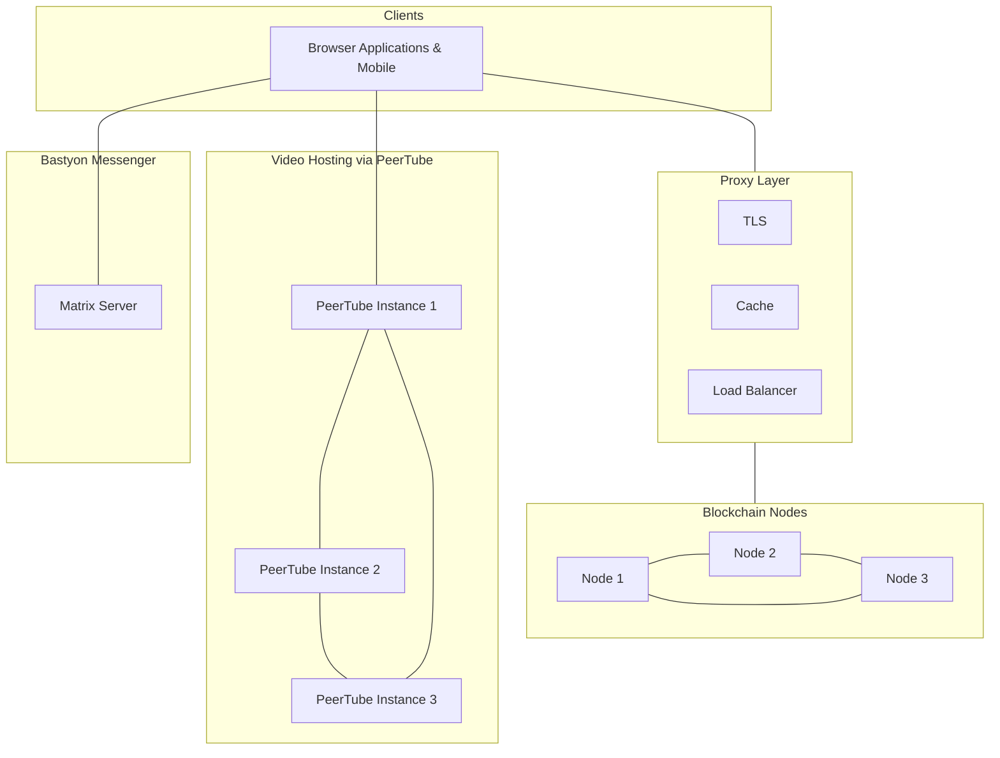

<!--
-  [x] Update readme.md with what this repo is all about
-  [ ] Share this information with stakeholders
-->

  <b>en</b> | <a href="readme_ru.md">ru</a>

  

# Get Started with Bastyon

Hello and welcome to Bastyon! We're excited to have you here and hope this project will excite you as much as it excites us!

Bastyon is on a mission to democratize how people communicate. Today, most communication is centralized. It's not an overstatement to say that anyone can get unplugged from any platform for any reason, forcing them to lose their ability to communicate with loved ones, create content, or access their own data. Bastyon is changing this.

>**Vision:**
Bastyon aims to create a resilient, decentralized ecosystem that empowers individuals with unrestricted access to communication, information, and personal data management. Our vision is to build a platform that stands strong against censorship and ensures user sovereignty in the digital realm.

This repo is meant to be an entry point into the project. It has descriptions and overview of other repos and how they are all connected.

If you know what you want to help with, you could jump straight to the [How To...?](#how-to) section.

> **Note:** But before you jump in, please make sure you check out [Contribution Guide](contribution.md). 

## 📝 Bastyon Architectural Overview

[Coming Soon - Detailed architectural documentation and diagrams will be added here]

The application flow architecture largerly depends on the content, users are interacting with.

## 🏗️ Bastyon Platform Structure

The Bastyon Platform consists of these main blocks:

- [Roadmap](#roadmap)
- [Documentation](#documentation)
- [Bastyon User Interfaces](#bastyon-user-interfaces)
- [Bastyon Protocols, Network, and Node Software](#bastyon-protocols-network-and-node-software)
- [Bastyon Integrations](#bastyon-integrations)

Below are the repositories for each respective platform component:

### 🗂️ Bastyon Project Overview

`This.repo`

An entry point that helps newcomers navigate the Bastyon project.

### 🛣️ Roadmap [🔗](https://github.com/pocketnetteam/roadmap)

This repo is used for submission, tracking, and discussion of new proposals. The conversations in this repo remain active until proposals either get approved (with a willing contributor) or rejected. In both cases, the natural end state for a proposal is to be archived with a decision note.

### ✍️ Documentation [🔗](https://github.com/pocketnetteam/documentation)

This repo contains documentation files that power the Bastyon documentation site. They are expected to be evergreen and maintained by everyone, including developers who make observable changes that require documentation updates.

### 🎨 Bastyon User Interfaces

Bastyon Graphical User Interfaces include Mobile Apps, Desktop and Web Browser Apps across several repositories.

#### 🛠️ Bastyon Application UI [🔗](https://github.com/pocketnetteam/pocketnet.gui)

The `pocketnet.gui` repo holds the codebase for end-user applications. You can make changes and build and run locally for Desktop, Browser app, and Mobile Apps.

#### 🗨️ Bastyon Messenger UI [🔗](https://github.com/pocketnetteam/bastyon-chat)

The messenger component of Bastyon, enabling secure, decentralized communication between users.

#### 📞💻 Bastyon Calls UI [🔗](https://github.com/pocketnetteam/bastyon-video)

The video calling and conferencing interface, providing peer-to-peer communication capabilities.

#### 🔄 Barteron GUI [🔗](https://github.com/pocketnetteam/barteron.gui)

This repo contains the User Interface for Barteron - a decentralized marketplace.

### 🖧🔒 Bastyon Protocols, Network, and Node Software

Back-End block (Node Software, Blockchain Explorer, Bastyon Platform API)

[Core Protocol and Network Implementation](https://github.com/pocketnetteam/pocketnet.core)

[Blockchain Explorer Interface](https://github.com/pocketnetteam/pocketnet.explorer)

[Platform API Services](https://github.com/pocketnetteam/pocketnet-proxy-api)

### 🧩 Bastyon Integrations

#### 🎬 Bastyon Video Implementation [🔗](https://github.com/pocketnetteam/bastyon-video)

This repo is a fork of PeerTube, a free, decentralized and federated video platform developed as an alternative to other platforms that centralize our data and attention, such as YouTube, Dailymotion or Vimeo. 🎬

It contains the integration code with Bastyon and the PeerTube code itself.

## Looking to Contribute?

If you'd like to contribute, please read our [CONTRIBUTING.md](CONTRIBUTING.md)

## How To

[Coming Soon - ]...

### How Do I contribute to the Bastyon Application Development?
### How Do I contribute to the Bastyon Node Development?
### How Do I contribute to Bastyon in Other Ways?
### How Do I contribute to the Bastyon Documentation?
### How Do I contribute to the Bastyon Documentation Translation?
### How Do I contribute to the Bastyon Chat Messenger?

