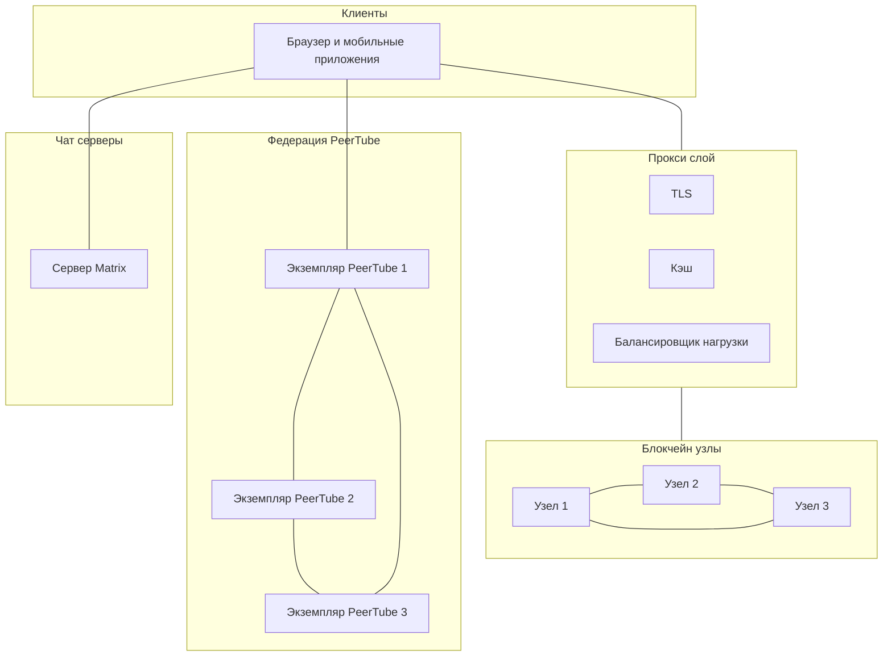

<!--
-  [x] Обновить readme.md с информацией о репозитории
-  [ ] Поделиться этой информацией с заинтересованными сторонами
-->

  <a href="readme.md">en</a> | <b>ru</b>

  

# Начало работы с Bastyon

Здравствуйте и добро пожаловать в Bastyon! Мы рады видеть вас здесь и надеемся, что этот проект вызовет у вас такой же интерес, как и у нас!

Bastyon стремится демократизировать способы общения людей. Сегодня большинство коммуникаций централизованы. Не будет преувеличением сказать, что любой человек может быть отключен от любой платформы по любой причине, что лишает его возможности общаться с близкими, создавать контент или получать доступ к своим данным. Bastyon меняет это.

>**Видение:**
Bastyon стремится создать устойчивую, децентрализованную экосистему, которая предоставляет людям неограниченный доступ к коммуникациям, информации и управлению личными данными. Наша цель - создать платформу, которая будет противостоять цензуре и обеспечивать суверенитет пользователей в цифровом мире.

Этот репозиторий предназначен для того, чтобы быть отправной точкой в проекте. В нем содержатся описания и обзоры других репозиториев и их взаимосвязей.

Если вы знаете, чем хотите помочь, вы можете сразу перейти к разделу [Как начать?](#how-to).

> **Примечание:** Но прежде чем приступить, пожалуйста, ознакомьтесь с [Руководством по вкладу](contribution.md). 

## 📝 Обзор архитектуры Bastyon

[Скоро будет добавлена подробная архитектурная документация и диаграммы]

Архитектура потока приложения в значительной степени зависит от контента, с которым взаимодействуют пользователи.

## 🏗️ Структура платформы Bastyon

Платформа Bastyon состоит из следующих основных блоков:

- [Дорожная карта](#roadmap)
- [Документация](#documentation)
- [Пользовательские интерфейсы Bastyon](#bastyon-user-interfaces)
- [Протоколы, сеть и программное обеспечение узлов Bastyon](#bastyon-protocols-network-and-node-software)
- [Интеграции Bastyon](#bastyon-integrations)

Ниже представлены репозитории для каждого компонента платформы:

### 🗂️ Обзор проекта Bastyon

`Этот репозиторий`

Отправная точка, которая помогает новичкам ориентироваться в проекте Bastyon.

### 🛣️ Дорожная карта [🔗](https://github.com/pocketnetteam/roadmap)

Этот репозиторий используется для подачи, отслеживания и обсуждения новых предложений. Обсуждения в этом репозитории остаются активными до тех пор, пока предложения либо не будут одобрены (с готовым участником), либо отклонены. В обоих случаях естественным конечным состоянием предложения является его архивация с примечанием о решении.

### ✍️ Документация [🔗](https://github.com/pocketnetteam/documentation)

Этот репозиторий содержит файлы документации, которые обеспечивают работу сайта документации Bastyon. Предполагается, что они будут постоянно обновляться и поддерживаться всеми, включая разработчиков, которые вносят заметные изменения, требующие обновления документации.

### 🎨 Пользовательские интерфейсы Bastyon

Графические пользовательские интерфейсы Bastyon включают мобильные приложения, приложения для компьютеров и веб-браузеров в нескольких репозиториях.

#### 🛠️ Пользовательский интерфейс приложения Bastyon [🔗](https://github.com/pocketnetteam/pocketnet.gui)

Репозиторий `pocketnet.gui` содержит кодовую базу для пользовательских приложений. Вы можете вносить изменения, собирать и запускать локально для компьютера, браузера и мобильных приложений.

#### 🗨️ Пользовательский интерфейс мессенджера Bastyon [🔗](https://github.com/pocketnetteam/bastyon-chat)

Компонент мессенджера Bastyon, обеспечивающий безопасное децентрализованное общение между пользователями.

#### 📞💻 Пользовательский интерфейс звонков Bastyon [🔗](https://github.com/pocketnetteam/bastyon-video)

Интерфейс видеозвонков и конференций, обеспечивающий возможности одноранговой связи.

#### 🔄 Пользовательский интерфейс Barteron [🔗](https://github.com/pocketnetteam/barteron.gui)

Этот репозиторий содержит пользовательский интерфейс для Barteron - децентрализованной торговой площадки.

### 🖧🔒 Протоколы, сеть и программное обеспечение узлов Bastyon

[Реализация основного протокола и сети](https://github.com/pocketnetteam/pocketnet.core)

[Интерфейс обозревателя блокчейна](https://github.com/pocketnetteam/pocketnet.explorer)

[Сервисы API платформы](https://github.com/pocketnetteam/pocketnet-proxy-api)

### 🧩 Интеграции Bastyon

#### 🎬 Реализация Bastyon Video [🔗](https://github.com/pocketnetteam/bastyon-video)
Этот репозиторий является форком PeerTube - бесплатной, децентрализованной и федеративной видеоплатформы, разработанной как альтернатива другим платформам, которые централизуют наши данные и внимание, таким как YouTube, Dailymotion или Vimeo. 🎬

Он содержит код интеграции с Bastyon и сам код PeerTube.

## Как начать

[Скоро будет - ]...

### Как внести вклад в разработку приложения Bastyon?
### Как внести вклад в разработку узла Bastyon?
### Как еще можно внести вклад в Bastyon?
### Как внести вклад в документацию Bastyon?
### Как внести вклад в перевод документации Bastyon?
### Как внести вклад в мессенджер Bastyon Chat?

